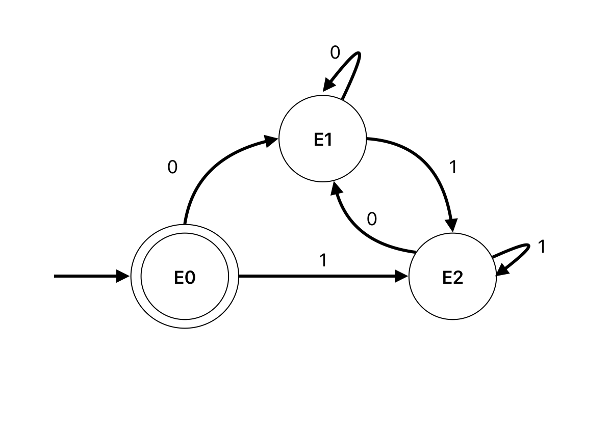

### Ejercicio 3a

Sobre $E_0 = (0|1)^*01$

$$\begin{align*}
\partial_0(E_0) &= \partial_0((0|1)^*)01 |  \partial_0(01) \\ 
&= \partial_0(0|1)(0|1)^*01 |  1 \\
&= (\partial_0(0) | \partial_0(1))(0|1)^*01 |  1 \\ 
&= (\lambda | \empty)(0|1)^*01 |  1 \\ 
E_1&= (0|1)^*01 |  1 \\ 
\\
\partial_1(E_0) &= \partial_1((0|1)^*)01 |  \partial_1(01) \\ 
&= \partial_1(0|1)(0|1)^*01 |  \empty \\
&= (\partial_1(0) | \partial_1(1))(0|1)^*01\\ 
&= (\empty | \lambda)(0|1)^*01\\ 
E_2&= (0|1)^*01\\ 
\end{align*}$$

Sobre $E_1$:

$$\begin{align*}
\partial_0(E_1) &= \partial_0((0|1)^*01) | \partial_0(1) \\
&= \partial_0((0|1)^*)01 |\partial_0(01)  | \empty \\
&= \partial_0((0|1))(0|1)^*01 |1  \\
E_1 &= (0|1)^*01 |1  \\
\\
\partial_1(E_1) &= \partial_1((0|1)^*01) | \partial_1(1) \\
&= \partial_1((0|1)^*)01 |\partial_1(01)  | \lambda \\
&= \partial_1((0|1))(0|1)^*01 |\empty|\lambda  \\
E_2 &= (0|1)^*01   \\
\end{align*}$$

Sobre $E_2$:
$$\begin{align*}
\partial_0(E_2) &= \partial_0((0|1)^*)01 | \partial_0(01) \\
&= \partial_0((0|1)^*)01 | 1 \\
&= \partial_0((0|1))(0|1)^*01 | 1 \\
E_1 &= (0|1)^*01 | 1 \\
\\
\partial_1(E_2) &= \partial_1((0|1)^*)01 | \partial_1(01) \\
&= \partial_1((0|1)^*)01 | \empty \\
&= \partial_1((0|1))(0|1)^*01 \\
E_2 &= (0|1)^*01 \\
\end{align*}$$

