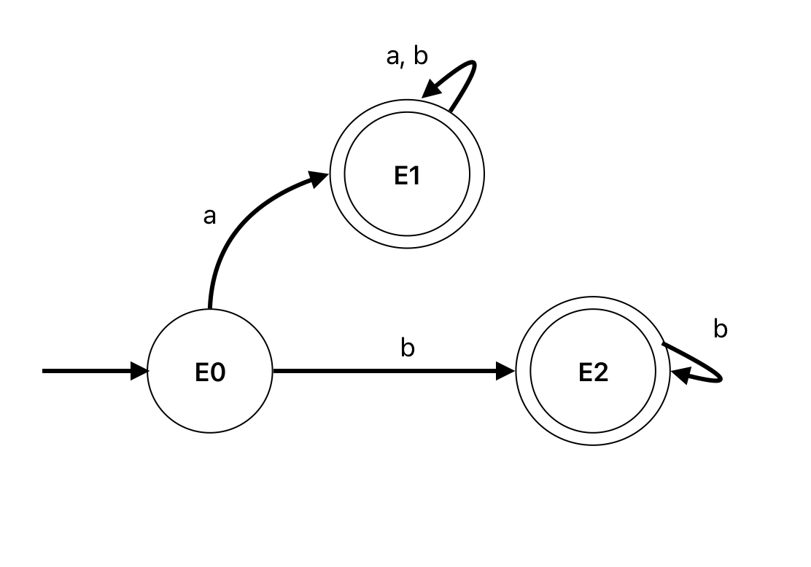

### Ejercicio 3b

Sobre $E_0 = a(b|\lambda)^*|b^+$

$$\begin{align*}
\partial_a(E_0) &= \partial_a(a(b|\lambda)^*) | \partial_a(b^+) \\
&= (b|\lambda)^* | \partial_a(b.b^*) \\
&= (b|\lambda)^* | \empty \\
E_1 &= (b|\lambda)^* \\
\\
\partial_b(E_0) &= \partial_b(a(b|\lambda)^*) | \partial_b(b^+) \\
&= \empty | \partial_b(b.b^*) \\
E_2 &= b^* \\
\end{align*}$$

Sobre $E_1 = (b|\lambda)^*$ 

$$\begin{align*}
\partial_a(E_1) &= \partial_a(b|\lambda)(b|\lambda)^* \\
E_1 &= (b|\lambda)^*\\
\\
\partial_b(E_1) &= \partial_b(b|\lambda)(b|\lambda)^* \\
&= \lambda(b|\lambda)^* \\
E_1 &= (b|\lambda)^* \\
\end{align*}$$

Sobre $E_2 = b^* $ 

$$\begin{align*}
\partial_a(E_2) &= \partial_a(b).b^* \\
&= \empty.b^* \\
E_T &= \empty \\
\\
\partial_b(E_2) &= \partial_b(b).b^* \\
&= \lambda.b^* \\
E_2 &= b^* \\
\end{align*}$$

