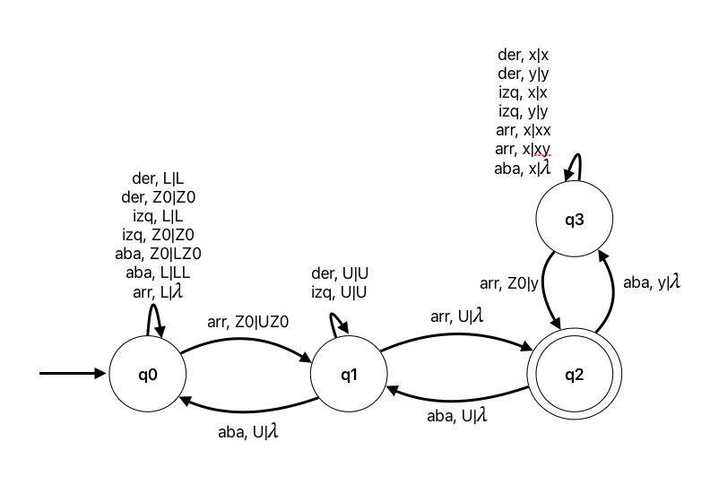

### Ejercicio 4

Es deterministico si $\forall q\in Q, z\in \Gamma, a\in \Sigma$:
- $|\delta(q,a,z)| \leq 1$
- $|\delta(q,\lambda,z)| \leq 1$
- $|\delta(q,\lambda,z)| = 1 \rightarrow |\delta(q,a,z)| = 0$ 

En este se cumple asi que es deterministico